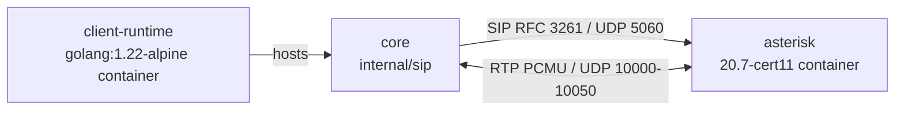

# Tradeoff analysis — Minimal SIP client: what RFC 3261 subset is sufficient to register and hold a call with a real PBX?

ATAM-lite, produced at P4. Instrument: `framework/instruments/atam-lite.md`.

## 1. Drivers

This concept must be good at three things. **Functional correctness:** the client completes
the scenario suite (register, two-way RTP call, hold/resume, teardown) against a real,
pinned PBX — that completion *is* the product. **Measurability:** every implemented behaviour
is traceable to the RFC 3261 section that forces it, because the whole point of the repository
is the H-001 subset measurement, not the client. **Fidelity:** the client must be a real
protocol implementation, not a mock of one, or the measurement is meaningless.

It is explicitly allowed to be bad at: breadth (features outside the suite — forking,
presence, subscription, S/MIME), performance (throughput/latency under load — the claim is
about subset size, not speed), robustness to hostile input (RFC 4475 torture tests are scoped
out in `docs/01-theory.md § 7`), and transport variety (UDP only, PCMU only).

## 2. Architecture

Three components (`.sota/readiness.yaml`): `core` (the from-scratch RFC 3261 client, TRL 5),
`asterisk` (the pinned certified 20.7 PBX the suite runs against, supporting, container, TRL 9
as a technology), `client-runtime` (the golang:1.22-alpine container hosting the client, host,
container, TRL 5). Two seams are scored: `core ↔ asterisk` (SIP/UDP 5060 + RTP/UDP, IRL 5) and
`core ↔ client-runtime` (process/exit-code, IRL 4).

| Mechanism | Carries which driver |
| :--- | :--- |
| Six mandatory headers + branch/tag rules (§8.1.1, §8.1.1.7) | Functional correctness (S-001) |
| HTTP-digest auth on REGISTER **and** initial INVITE (§22.4, RFC 2617) | Functional correctness — the PBX challenges both (E-004) |
| Offer/answer SDP, direction negotiation (RFC 3264 §5.1) | Functional correctness — hold/resume is sendonly/recvonly negotiation |
| Client transaction layer: T1/T2/64×T1 timers, Timer E retransmission, transactional ACK (§17) | Reliability (S-002) |
| Synchronous per-dialog UAC, one outstanding transaction (D-001) | Measurability — each behaviour maps to one code path, one matrix row |
| Trace recorder → message-trace matrix rows (D-001) | Measurability (S-003) |

## 3. Approaches considered

| Approach | Chosen | Rejected alternative | Why |
| :--- | :--- | :--- | :--- |
| Implementation language | Go, from scratch (D-001) | PJSIP bindings / libring / wrapper | The measurement must be of a real subset; reusing a stack means measuring the stack (D-001 rejected-options) |
| Control style | Synchronous per-dialog UAC (D-001) | Async reactor; UAS behaviour | One code path per behaviour → countable matrix rows; the suite is UAC-initiated only |
| Test structure | Two tiers: fake UAS + real-PBX integration (D-002) | Single tier (fake only, or integration only) | Faults need a misbehaving peer; the real PBX is the S-001 verification |
| Quality tooling | Project-local `.tools/` via `make tools` (D-003) | Global installs | R10: a clean machine must reproduce the gate |
| Transport | UDP only, port 5060 (§18) | TCP/TLS (sips) | Suite scope; UDP is the default SIP transport |
| Media | PCMU only, fixed RTP port from `Config` | Dynamic payload negotiation | Determinism — the matrix needs a pinned, countable environment |
| Liveness | UDP probe + transaction timeouts | Keepalives, OPTIONS polling | The suite defines the interaction surface; extra machinery is unpaid complexity |

## 4. Utility tree

Authoritative copy: `.sota/quality-gates.yaml`. Summary:

| ID | Characteristic | Sub-attribute | Priority | Difficulty |
| :--- | :--- | :--- | :--- | :--- |
| S-001 | functional-suitability | functional-completeness | high | high |
| S-002 | reliability | fault-tolerance | high | medium |
| S-003 | maintainability | analyzability | medium | medium |

S-001 and S-002 are the high-priority scenarios analysed in § 5.

## 5. Analysis of high-priority scenarios

| Scenario | Mechanism that responds | Finding | ID |
| :--- | :--- | :--- | :--- |
| S-001 (all suite steps complete vs pinned Asterisk) | Mandatory headers; digest on REGISTER+INVITE; offer/answer; transaction layer; RTP loop; trace | The PBX's endpoint `auth` config flips the whole suite: with auth on, digest on the **initial INVITE** is load-bearing — remove it and registration still works but calls fail at 401. One configuration knob on the far side moves functional completeness | SP-001 |
| S-001 | Transaction timers T1=500 ms / T2=4 s / 64×T1=32 s (§17) | A slower or lossy network path changes retransmission cadence; a PBX that responds outside these bounds turns a passing suite into timeouts. Timer constants are a single point of sensitivity for suite completion | SP-002 |
| S-001 | Offer/answer direction negotiation (RFC 3264 §5.1) | Hold/resume correctness is entirely the sendonly→recvonly / sendrecv→sendrecv mapping — one wrong direction flips a held call into a still-talking one | SP-003 |
| S-001 | 65535-byte receive buffer cap + strict parse-fail-ignore | Malformed/oversized responses are dropped, not fatal; the parser is fuzzed (E-003). Cap and strictness set the robustness envelope | SP-004 |
| S-002 (no torn-down calls across fault injection) | Timer E retransmission; wrong-branch filter; 64×T1 timeout→408; transactional ACK for non-2xx | Retransmission recovery and 408-on-timeout are unit-tested against the fake UAS (E-003); the 64×T1 bound caps the suite's worst-case setup delay at 32 s | SP-002 |
| S-003 (matrix analyzability) | Trace recorder granularity | The matrix is only as good as the trace rows; adding a behaviour without a trace row silently breaks the measurement | SP-005 |
| S-001 | Synchronous single-flight design (D-001) | One outstanding transaction per socket means the client cannot answer a PBX-initiated re-INVITE (hold from the far side) or OPTIONS while in a call. Simplicity/analyzability is bought with interaction capability | TP-001 |
| S-001 | Pinned environment: PCMU, fixed RTP port, pinned Asterisk image | Deterministic, reproducible suite at the cost of flexibility — a PBX configured differently simply fails the suite | TP-002 |

## 6. Adversarial pass

All five attacks, argued against the architecture above before the findings were recorded.

**A1 — Load.** At 10× designed volume (10 concurrent clients against the PBX), what breaks
first? Each client is a single UDP socket with one outstanding transaction, so the client side
serialises naturally; the PBX's pjsip layer is built for concurrency. The first real
collision: `Config.RTPPort` is a fixed field — ten instances all configured with port 40000
fight at the OS level before any SIP is exchanged. The suite is single-instance by design
(D-001), so this is a scoping fact, not a defect. → **R-006** (accepted).

**A2 — Failure.** Kill the most-depended-on component (Asterisk) mid-operation. Mid-setup:
the INVITE in flight gets ICMP port-unreachable → transaction returns 503 (tested). Mid-call:
RTP stops silently; the media loop's read deadline fires and `MediaPhase` returns the counts
it has; **the dialog stays "established" forever** — the client has no liveness signal and
`Hangup`'s BYE retransmits into a 32-second timeout. Nothing is corrupted and nothing is
lost, but the call object outlives the far end. → **R-003** (open).

**A3 — Change.** Most likely requirement change next month: "support a second codec"
(e.g. Opus). Touches `sdp.go` (offer construction, answer parsing) and `rtp.go` (payload
type ↔ codec map) — two files in one package, acceptable. The *more* likely change for a SIP
client is "also register against Kamailio/FreeSWITCH": the interop surface (auth edge cases,
dialog tag handling, 401-on-INVITE variation) is exactly the `message.go`/`digest.go`/
`dialog.go` surface, and only one PBX has ever been exercised. → **R-004** (open).

**A4 — Adversary.** An untrusted caller controls every input. The client is UAC-only; it never
accepts inbound connections, so the only input surface is responses arriving on its socket.
The branch filter (§17.1.3) rejects foreign responses — wrong-branch is unit-tested. Oversized
messages stop at the 65535-byte cap, malformed ones fail parse and are ignored; the fuzz
corpus covers both. The genuinely weak boundary: **credentials and media travel unencrypted**
— a response-spoofing or sniffing attacker on a shared network sees the digest challenge and
can mount an offline dictionary attack. That is out of scope by the drivers (theory §7 scopes
security out) and the suite runs on an isolated compose network. → **NR-002**, **NR-003**.

**A5 — Substitution.** A competent engineer solves this with PJSIP in an afternoon: the full
suite passes plus TCP/TLS, codecs, forking, presence. What do they lose? Nothing they would
notice while *using* SIP — and that is exactly the point: **for using SIP, the incumbent loses
nothing; for answering H-001 it is useless**, because PJSIP cannot say which parts of
RFC 3261 are load-bearing. The concept's value is the measurement instrument (matrix +
trace + evidence), not the client. This is recorded in the README limitations.

## 7. Sensitivity points

| ID | Decision or parameter | Attribute it moves | Scenario |
| :--- | :--- | :--- | :--- |
| SP-001 | PBX endpoint `auth` config → digest required on the initial INVITE | functional-completeness | S-001 |
| SP-002 | Transaction timers T1/T2/64×T1 (§17) | fault-tolerance, and suite worst-case latency | S-001, S-002 |
| SP-003 | Offer/answer direction mapping (RFC 3264 §5.1) | functional-completeness (hold/resume) | S-001 |
| SP-004 | 65535-byte buffer cap + strict parse-fail-ignore | robustness to malformed input | S-001, S-002 |
| SP-005 | Trace recorder granularity | analyzability (matrix completeness) | S-003 |

## 8. Tradeoff points

| ID | Decision | Improves | At the cost of | Chosen because |
| :--- | :--- | :--- | :--- | :--- |
| TP-001 | Synchronous single-flight UAC (D-001) | analyzability (S-003), simplicity, countable matrix rows | interaction capability — no PBX-initiated re-INVITE/OPTIONS handling while busy | the suite's interaction surface is UAC-initiated only; the claim is about subset size, not concurrency |
| TP-002 | Pinned environment: PCMU, fixed RTP port, pinned Asterisk image | functional-correctness determinism and reproducibility of the measurement (S-001) | flexibility — a differently-configured PBX fails the suite instead of degrading | the whole point is a countable, reproducible suite; flexibility would blur the matrix |

## 9. Risks and non-risks

| ID | Statement | Scenario | State | Mitigation / justification |
| :--- | :--- | :--- | :--- | :--- |
| R-001 | PCMU-only + fixed RTP port: a PBX configured for another codec or port range fails the suite outright | S-001 | accepted | The suite pins the environment (pjsip.conf/rtp.conf in `poc/asterisk/`); the claim is scoped to the pinned configuration (README limitations) |
| R-002 | UDP-only transport: a deployment forcing TCP or TLS fails the suite | S-001 | open | P5 may scope the claim to UDP explicitly or add a TCP leg; Asterisk's pjsip listener supports both, so the knob is on our side |
| R-003 | No liveness detection on an established dialog: a dead far end leaves the call hanging until the application decides to Hangup (BYE then times out at 32 s) | S-002 | open | Application-level watchdog or a `MediaHealth()` exposure at P5; the suite never kills the PBX mid-call, so this is unmeasured |
| R-004 | Interop breadth is unmeasured beyond one PBX: the message/dialog/auth surface has only ever run against pinned Asterisk 20.7 | S-001 | open | Claim stays scoped to "pinned Asterisk" (singular); adding a second PBX at P5 would test the interop surface and is optional |
| R-005 | Credentials and media are unencrypted (no TLS/sips): an on-path attacker on a shared network can sniff the digest challenge and brute-force the password | S-001 | accepted | Security is explicitly out of scope (`docs/01-theory.md § 7`); the suite runs on an isolated compose network; recorded so the assumption is visible when the deployment context changes |
| R-006 | Fixed `Config.RTPPort`: N concurrent client instances must be configured with distinct ports or collide at the OS level | S-001 | accepted | Single-instance suite by design (D-001); a multi-call benchmark would need port allocation, which is unpaid complexity today |
| NR-001 | The fake UAS approximates the PBX's failure behaviour closely enough that unit-tier fault tests transfer to the real seam | — | — | Safe while the integration tier keeps passing (E-004) and the fake's scripted behaviours stay aligned with observed Asterisk behaviour (401 on REGISTER+INVITE, recvonly hold answers). Re-check whenever the PBX version moves |
| NR-002 | Containerised Asterisk behaves like a production Asterisk for the suite | — | — | Safe while the suite stays within the res_pjsip/chan_pjsip surface — the same code in both. Re-check if the suite needs OS-level RTP timing guarantees |
| NR-003 | Wrong-branch and foreign responses are rejected by branch matching on the single socket | — | — | Safe while there is exactly one outstanding transaction per socket (TP-001's single-flight design). Re-check the moment two transactions can interleave |

Integrations scoring IRL < 4 would require a risk here; both seams score ≥ 4 (core↔asterisk
IRL 5, core↔client-runtime IRL 4), so no `risk_ref` is attached to any integration.

## 10. Risk themes

| Theme | Risks | Driver endangered | Mitigation roadmap |
| :--- | :--- | :--- | :--- |
| Interop surface | R-001, R-002, R-004 | functional-suitability (S-001) | Keep the claim scoped to the pinned configuration; decide at P5 whether the claim says "Asterisk" or "a mainstream PBX" — a second PBX is the only way to widen it honestly |
| Dead-far-end blindness | R-003 | reliability (S-002) | Expose a media-health signal or document the application-level hangup timeout; add a kill-the-PBX mid-call test to the integration tier |
| Claim vs. measurement hygiene | R-005, R-006, NR-001…003 | the honest H-001 verdict | The matrix counts only MUSTs the suite forces; keep the environment pinned and the assumptions in NR-001…003 visible at P5 |

**Complexity ledger re-walk (workflow step 6).** The utility tree is final after ATAM; no
scenario was removed. Every ledger entry still justifies: `internal/sip` (S-001, S-003),
trace recorder (S-003), fake UAS (S-002), compose stack (S-001), `.tools` toolchain (S-001,
S-002). Nothing is removed from the codebase.
