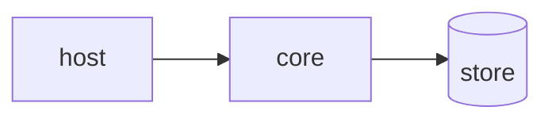

# Tradeoff analysis — Minimal SIP client: what RFC 3261 subset is sufficient to register and hold a call with a real PBX?

ATAM-lite, produced at P4.

## 1. Drivers

<!-- What this must be good at, and what it is allowed to be bad at. Two or three sentences.
     Being explicit about the second half is the whole point. -->

TODO

## 2. Architecture

<!-- Components, seams, data flow. A diagram (mermaid is fine) plus the list of mechanisms
     that carry the drivers. Component names must match .sota/readiness.yaml. -->

| Mechanism | Carries which driver |
| :--- | :--- |
| TODO | TODO |

## 3. Approaches considered

| Approach | Chosen | Rejected alternative | Why |
| :--- | :--- | :--- | :--- |
| TODO | ✔ | TODO | TODO |

## 4. Utility tree

Authoritative copy: `.sota/quality-gates.yaml`. Summary:

| ID | Characteristic | Priority | Difficulty |
| :--- | :--- | :--- | :--- |
| S-001 | TODO | high | high |

## 5. Analysis of high-priority scenarios

| Scenario | Mechanism that responds | Finding | ID |
| :--- | :--- | :--- | :--- |
| S-001 | TODO | TODO | SP-001 |

## 6. Adversarial pass

All five attacks are mandatory; attack 5 is the RDD check.

**A1 — Load.** At 10× designed volume, what breaks first and what is the symptom?
> TODO → R-00? / dismissed because TODO

**A2 — Failure.** Kill the most-depended-on component mid-operation.
> TODO

**A3 — Change.** The most likely requirement change lands next month; how many components move?
> TODO

**A4 — Adversary.** An untrusted caller controls every input; which trust boundary is weakest?
> TODO

**A5 — Substitution.** A competent engineer solves this with the P1 incumbent and no new
machinery. What exactly do they lose?
> TODO — if the honest answer is "not much", record it here **and** in the README limitations.

## 7. Sensitivity points

| ID | Decision or parameter | Attribute it moves | Scenario |
| :--- | :--- | :--- | :--- |
| SP-001 | TODO | TODO | S-001 |

## 8. Tradeoff points

| ID | Decision | Improves | At the cost of | Chosen because |
| :--- | :--- | :--- | :--- | :--- |
| TP-001 | TODO | TODO | TODO | TODO |

## 9. Risks and non-risks

| ID | Statement | Scenario | State | Mitigation / justification |
| :--- | :--- | :--- | :--- | :--- |
| R-001 | TODO | S-001 | open | TODO |
| NR-001 | TODO is safe while TODO holds | — | — | Assumption to re-check when TODO changes |

Every integration scoring IRL < 4 in `.sota/readiness.yaml` must appear here as an `R-###`
and be referenced by that integration's `risk_ref`.

## 10. Risk themes

| Theme | Risks | Driver endangered | Mitigation roadmap |
| :--- | :--- | :--- | :--- |
| TODO | R-001 | TODO | TODO |
